# Project NEXUS

A full-stack AI system built around a custom GPT-style Transformer pretrained on a 5,000-row instruction dataset, enhanced with LoRA fine-tuning, semantic memory via FAISS, and a Retrieval-Augmented Generation pipeline. The entire model architecture is hardcoded from scratch in PyTorch to achieve maximum customization.

---

## Table of Contents

- [System Overview](#system-overview)
- [Architecture Diagram](#architecture-diagram)
- [Model Architecture](#model-architecture)
  - [Input Processing Pipeline](#input-processing-pipeline)
  - [Self-Attention Mechanism](#self-attention-mechanism)
  - [Scaled Dot-Product Attention](#scaled-dot-product-attention)
  - [Transformer Block](#transformer-block)
  - [Full GPT Forward Pass](#full-gpt-forward-pass)
  - [LoRA Adaptation](#lora-adaptation)
  - [Autoregressive Generation](#autoregressive-generation)
- [Memory System](#memory-system)
  - [Knowledge Seed Lifecycle](#knowledge-seed-lifecycle)
  - [MemoryStore Internal Operations](#memorystore-internal-operations)
- [RAG Pipeline](#rag-pipeline)
- [Backend API Architecture](#backend-api-architecture)
  - [Dual Inference Engine](#dual-inference-engine)
  - [Frontend-Backend Communication](#frontend-backend-communication)
- [Training Pipeline](#training-pipeline)
- [Deployment Architecture](#deployment-architecture)
- [Configuration Reference](#configuration-reference)
- [Project Structure](#project-structure)
- [Dependencies](#dependencies)

---

## System Overview

Project NEXUS is composed of four core layers:

1. **Model Layer** — A decoder-only GPT Transformer implemented from scratch in PyTorch (12 layers, 12 heads, 768 embedding dimension, 50,257 token vocabulary). The model is pretrained on 5,000 instruction-response pairs using Alpaca formatting, with every architectural component hardcoded for full control.

2. **Memory Layer** — An in-memory semantic store backed by FAISS (IndexFlatL2) and sentence-transformers (all-MiniLM-L6-v2, 384 dimensions). Each stored unit is a "Knowledge Seed" containing the original query, model response, embedding vector, semantic category, and an importance score that decays over time.

3. **RAG Layer** — A Retrieval-Augmented Generation pipeline that retrieves relevant Knowledge Seeds from memory, re-ranks them by a combined similarity-plus-importance score, and assembles them into a structured prompt before passing to the language model.

4. **Serving Layer** — A FastAPI backend with dual inference modes (OpenRouter cloud API or local GPT-2 + LoRA fallback), a React 19 frontend with Vite 7 and Clerk authentication, and Docker Compose orchestration for deployment.

---

## Architecture Diagram

This diagram shows every major component and how data flows between them from the user's browser down to the inference engine and back.

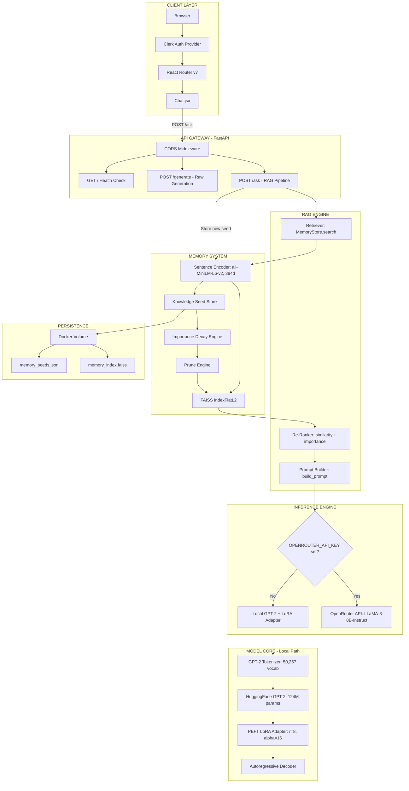

---

## Model Architecture

The model is a decoder-only GPT-style Transformer written entirely from scratch. No pre-built attention modules or transformer blocks from external libraries are used. Every layer — attention, normalization, activation, feed-forward — is implemented as a standalone PyTorch `nn.Module`.

### Input Processing Pipeline

Before any transformer computation, raw text must be converted into a numerical tensor the model can process. This happens in four sequential sub-steps.

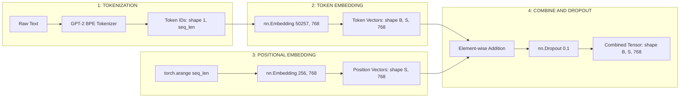

**Step 1 — Tokenization.** The raw text string is converted to a sequence of integer token IDs using GPT-2's Byte-Pair Encoding tokenizer with a vocabulary of 50,257 tokens.

**Step 2 — Token Embedding.** Each token ID indexes into a learned embedding table of shape (50,257 x 768), producing a 768-dimensional vector per token. This table contains 38.6 million parameters.

**Step 3 — Positional Embedding.** Since transformers have no inherent notion of token order, a separate learned embedding table of shape (256 x 768) maps each position index (0 through 255) to a 768-dimensional vector. This limits the maximum context length to 256 tokens.

**Step 4 — Combine and Dropout.** The token and position vectors are added element-wise via broadcasting, then 10% of elements are randomly zeroed during training by dropout to prevent overfitting.

---

### Self-Attention Mechanism

The codebase implements four evolutionary stages of self-attention, each building on the previous one. This progression is intentional — it shows how the mechanism scales from a minimal educational form to the production multi-head version.

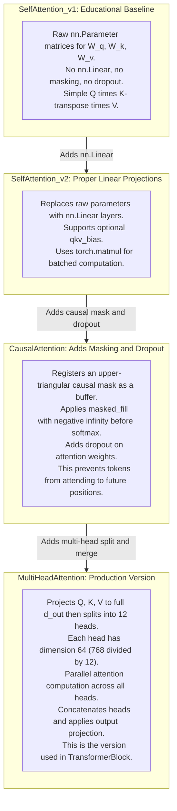

**Why four versions?** The model was built incrementally. SelfAttention_v1 validates the core math. v2 adds proper parameterization. CausalAttention adds the autoregressive constraint. MultiHeadAttention adds parallelism across multiple representation subspaces.

---

### Scaled Dot-Product Attention

This is what happens inside each attention head — the fundamental operation that allows the model to weigh which tokens are relevant to which other tokens.

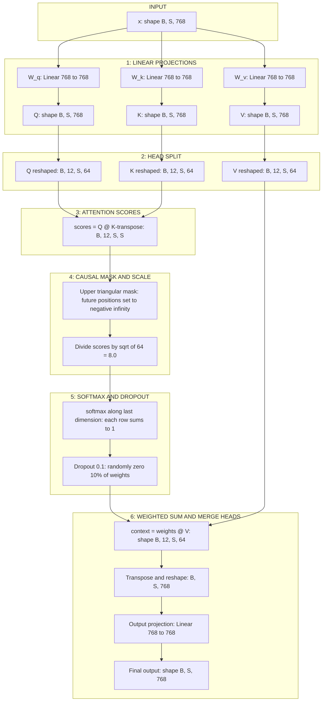

**Causal masking explained.** In a sequence of length 4, the attention matrix before masking allows every token to attend to every other token. After masking, the upper triangle is set to negative infinity. When softmax is applied, those positions become zero probability. The result is that token 0 can only attend to itself, token 1 can attend to tokens 0 and 1, token 2 can attend to tokens 0 through 2, and so on. This is what makes the model autoregressive — it can only use past context to predict the next token.

**Why divide by sqrt(d_k)?** Without scaling, the dot products between Q and K grow large as the dimension increases, pushing softmax into regions where gradients are extremely small. Dividing by sqrt(64) = 8.0 keeps the variance of the scores at approximately 1 regardless of dimension, maintaining healthy gradient flow.

---

### Transformer Block

Each transformer block follows a pre-norm residual architecture. The key difference from the original Transformer paper is that LayerNorm is applied before the sub-layer (attention or FFN) rather than after. This allows gradients to flow directly through the residual skip connections without being distorted by normalization.

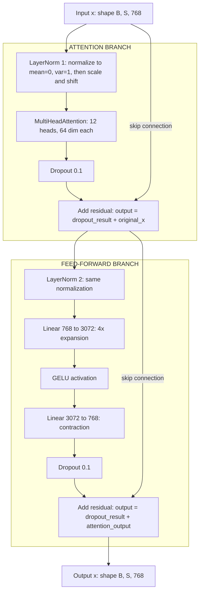

**LayerNorm operation.** For each token vector of dimension 768, compute the mean and variance across that dimension, normalize to zero mean and unit variance (with epsilon=1e-5 for numerical stability), then apply learned scale (gamma) and shift (beta) parameters. Formula: `output = gamma * (x - mean) / sqrt(variance + 1e-5) + beta`.

**Feed-forward network.** The FFN first expands the representation from 768 to 3072 dimensions (4x expansion), applies the GELU activation function (a smooth approximation of ReLU), then contracts back to 768. This expansion-contraction pattern allows the network to model more complex non-linear transformations in a higher-dimensional space before projecting back.

**GELU activation.** Defined as `0.5 * x * (1 + tanh(sqrt(2/pi) * (x + 0.044715 * x^3)))`. Unlike ReLU which hard-clips at zero, GELU provides a smooth, probabilistic gating that allows small negative values through. This is the activation used by GPT-2 and GPT-3.

**Residual connections.** Both the attention and FFN branches add their input directly to their output. This creates a "gradient highway" — during backpropagation, gradients can flow directly through the addition without being diminished by the layers in between, enabling effective training of deep networks.

---

### Full GPT Forward Pass

This diagram shows the complete forward pass from input token IDs to output logits across all 12 transformer layers.

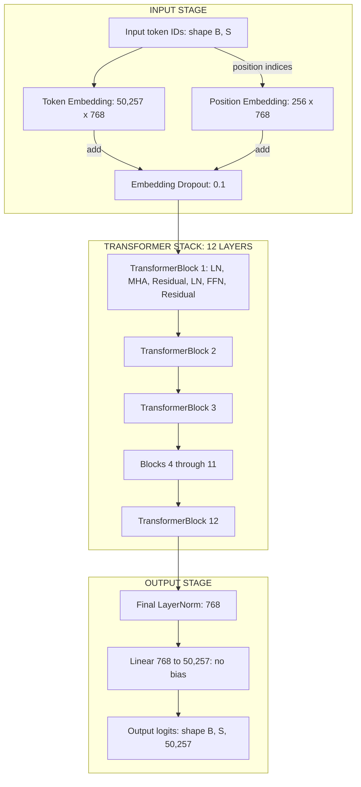

**Parameter count breakdown:**

| Component | Calculation | Parameters |
|---|---|---|
| Token Embedding | 50,257 x 768 | 38,597,376 |
| Position Embedding | 256 x 768 | 196,608 |
| Per Block: LayerNorm x 2 | 768 x 2 x 2 | 3,072 |
| Per Block: MHA (Q + K + V) | 768 x 768 x 3 | 1,769,472 |
| Per Block: MHA out_proj | 768 x 768 | 589,824 |
| Per Block: FFN expand | 768 x 3,072 | 2,359,296 |
| Per Block: FFN contract | 3,072 x 768 | 2,359,296 |
| Block subtotal | | ~7.1M |
| All 12 blocks | 7.1M x 12 | ~85.1M |
| Final LayerNorm | 768 x 2 | 1,536 |
| Output Head | 768 x 50,257 | 38,597,376 |
| **Total** | | **~163M** |

---

### LoRA Adaptation

LoRA (Low-Rank Adaptation) injects small trainable matrices into the frozen pretrained model. Instead of updating all 163M parameters, only ~295K parameters (0.18% of the total) are trained. The rest of the model stays completely frozen.

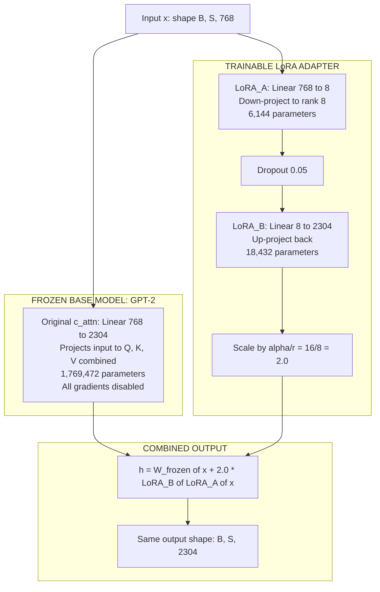

**Why only the c_attn module?** GPT-2 uses a single fused linear layer called `c_attn` that projects the input to Query, Key, and Value simultaneously (768 to 2304, where 2304 = 3 x 768). By adapting only this module, LoRA modifies how the model computes its attention patterns — the most impactful part of the transformer — while leaving everything else frozen.

**Parameter efficiency:**

| | Count |
|---|---|
| LoRA_A per layer | 768 x 8 = 6,144 |
| LoRA_B per layer | 8 x 2,304 = 18,432 |
| Per layer total | 24,576 |
| Across 12 layers | 294,912 |
| Adapter file size | ~1.1 MB |
| Percentage of total model | 0.18% |

---

### Autoregressive Generation

Text generation works by repeatedly predicting one token at a time, appending it to the input, and feeding the extended sequence back into the model. This loop continues until a maximum token count is reached or an end-of-sequence token is generated.

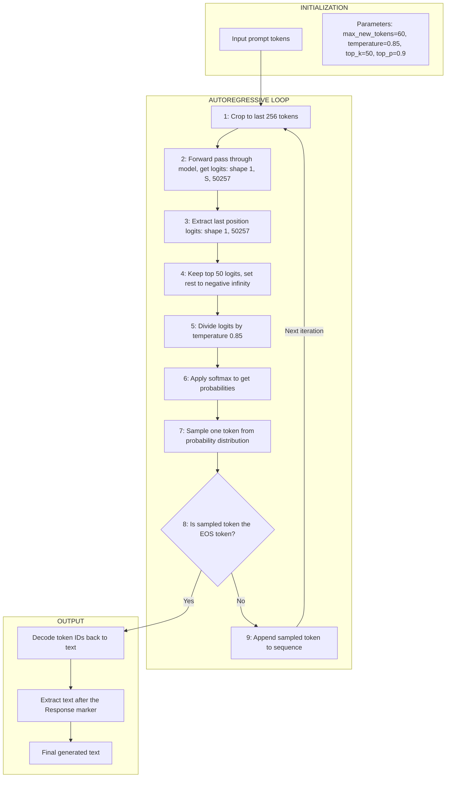

**Temperature controls randomness.** Temperature is a scaling factor applied to logits before softmax. Lower temperature (e.g. 0.1) makes the distribution sharper, causing the model to almost always pick the highest-probability token (nearly greedy). Higher temperature (e.g. 2.0) flattens the distribution, making all tokens more equally likely (more random). The model uses 0.85, which is a balanced setting between coherence and creativity.

**Top-k filtering.** Before sampling, only the top 50 highest-probability tokens are kept. All others are set to negative infinity, which makes them zero after softmax. This prevents the model from sampling very unlikely tokens that would produce incoherent text.

**Repetition penalty.** A penalty of 1.3 is applied to tokens that have already appeared in the output, and any n-gram of length 3 that already exists is prevented from being generated again. This reduces the common problem of language models repeating the same phrases in a loop.

---

## Memory System

The memory system is the core innovation of Project NEXUS. It stores every user-model interaction as a structured "Knowledge Seed" and uses vector similarity search to retrieve relevant past interactions when answering new queries.

### Knowledge Seed Lifecycle

Each Knowledge Seed goes through a well-defined lifecycle: birth (creation and storage), aging (importance decay on every new interaction), retrieval (boost when accessed), and death (pruning when importance falls below threshold).

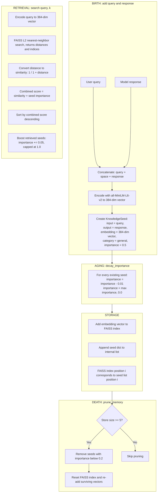

**Importance dynamics explained.** Every seed starts with importance 0.5. Each time any new interaction is added to memory, all existing seeds lose 0.01 importance (decay). When a seed is retrieved during a search, it gains 0.05 importance (boost). Seeds that are frequently relevant get retrieved often and maintain high importance. Seeds that are never relevant slowly decay toward zero. Once importance drops below 0.2, the seed is pruned from memory on the next prune cycle. This creates a natural selection mechanism — useful memories survive, irrelevant ones are forgotten.

**Example timeline for a single seed:**

```
t=0:  importance = 0.50  (just created)
t=1:  importance = 0.49  (decayed by 0.01)
t=2:  importance = 0.48  (decayed)
t=3:  importance = 0.47  (decayed)
      -- Retrieved during search --
      importance = 0.47 + 0.05 = 0.52  (boosted)
t=4:  importance = 0.51  (decayed)
...
t=30: importance = 0.22  (never retrieved again, steadily decaying)
t=32: importance = 0.20  (at threshold)
t=33: importance = 0.19  (below 0.2 -- PRUNED)
```

---

### MemoryStore Internal Operations

This breaks down every method inside the MemoryStore class into its sub-operations.

```mermaid
graph TB
    subgraph ENCODE["_encode text: returns numpy array"]
        E1["Input: text string"]
        E2["SentenceTransformer model encodes to numpy"]
        E3["Cast to float32 for FAISS compatibility"]
        E4["Output: shape 1, 384"]
        E1 --> E2 --> E3 --> E4
    end

    subgraph ADD["add: query, response, category, importance"]
        A1["Concatenate query and response"]
        A2["Encode concatenated text to 384-dim vector"]
        A3["Build seed dict with input, output, embedding, category, importance"]
        A4["Call decay_importance on all existing seeds"]
        A5["Add vector to FAISS index"]
        A6["Append seed to internal list"]
        A7{"Total seeds >= 5?"}
        A8["Call prune_memory"]
        A1 --> A2 --> A3 --> A4 --> A5 --> A6 --> A7
        A7 -->|"Yes"| A8
    end

    subgraph SEARCH["search: query, k"]
        S1{"Index empty?"}
        S2["Clamp k to index size"]
        S3["Encode query to 384-dim vector"]
        S4["FAISS L2 search returns distances and indices"]
        S5["For each result: similarity = 1 / 1 + distance"]
        S6["Combined score = similarity + importance"]
        S7["Sort candidates by score descending"]
        S8["Boost importance of returned seeds by 0.05"]
        S1 -->|"Yes"| Empty["Return empty list"]
        S1 -->|"No"| S2 --> S3 --> S4 --> S5 --> S6 --> S7 --> S8
    end

    subgraph PRUNE["prune_memory"]
        P1["Filter: keep seeds with importance >= 0.2"]
        P2["Count removed seeds"]
        P3{"Any removed?"}
        P4["Reset FAISS index"]
        P5["Replace seed list with survivors"]
        P6["Batch re-add all surviving vectors to FAISS"]
        P1 --> P2 --> P3
        P3 -->|"Yes"| P4 --> P5 --> P6
        P3 -->|"No"| NoOp["Return 0"]
    end

    subgraph PERSIST["Persistence"]
        SaveFAISS["faiss.write_index to memory_index.faiss"]
        SaveJSON["json.dump seeds to memory_seeds.json"]
        LoadFAISS["faiss.read_index from memory_index.faiss"]
        LoadJSON["json.load seeds from memory_seeds.json"]
    end
```

---

## RAG Pipeline

The RAG pipeline orchestrates the full cycle: retrieve relevant context from memory, build a structured prompt, generate a response, and store the new interaction back into memory.

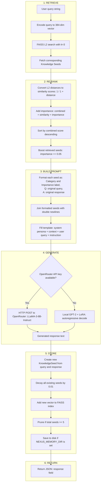

**Prompt template.** The final prompt sent to the language model follows this structure:

```
You are NEXUS, an evolving AI system.

Context:
[Category: emergency | Importance: 0.52]
Q: fire detected in building
A: Evacuate immediately and call emergency services.

[Category: general | Importance: 0.48]
Q: what should I do in a fire
A: Follow the evacuation plan and stay low.

User Query:
How do I handle a fire emergency?

Answer intelligently using the most relevant patterns from context.
```

---

## Backend API Architecture

The backend is a FastAPI application that initializes model loading, memory, and CORS at startup, then serves three endpoints.

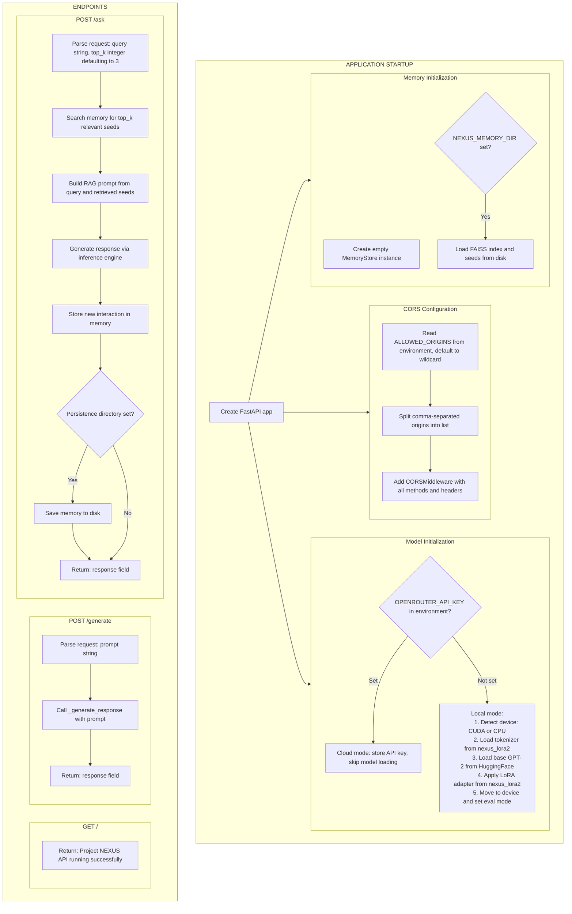

---

### Dual Inference Engine

The `_generate_response` function routes to one of two backends depending on whether an OpenRouter API key is configured.

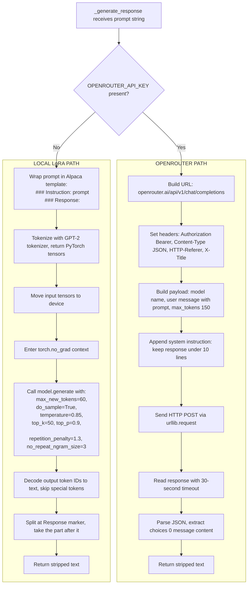

---

### Frontend-Backend Communication

This sequence diagram shows the exact flow of data when a user sends a message in the chat interface.

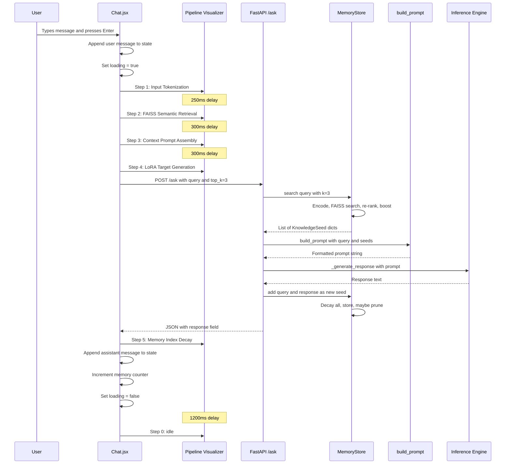

---

## Training Pipeline

The model is pretrained on a 5,000-row instruction dataset. Each row contains an instruction, optional input, and expected output in Alpaca format.

```mermaid
graph TB
    subgraph DATA["DATA PREPARATION"]
        Raw["Raw instruction dataset: 5000 rows"]
        Format["format_input: convert to Alpaca template
        Below is an instruction...
        ### Instruction: instruction text
        ### Input: input text if present"]
        AppendResp["Append: ### Response: expected output"]
        Tokenize["Tokenize full text to integer IDs"]
        Dataset["InstructionDataset: list of encoded sequences"]
        Loader["DataLoader: batch_size=8, shuffle=True"]
        Raw --> Format --> AppendResp --> Tokenize --> Dataset --> Loader
    end

    subgraph LOOP["TRAINING LOOP"]
        EpochLoop["For each epoch in num_epochs"]
        BatchLoop["For each input_batch, target_batch in DataLoader"]

        subgraph FORWARD["FORWARD PASS"]
            ToDevice["Move batches to device"]
            ModelForward["Compute logits = model of input_batch"]
            Flatten["Flatten logits: B*S, 50257 and targets: B*S"]
            Loss["Compute cross_entropy loss: scalar"]
            ToDevice --> ModelForward --> Flatten --> Loss
        end

        subgraph BACKWARD["BACKWARD PASS"]
            ZeroGrad["optimizer.zero_grad: clear old gradients"]
            BackProp["loss.backward: compute all gradients"]
            Step["optimizer.step: update parameters"]
            ZeroGrad --> BackProp --> Step
        end

        subgraph EVAL["PERIODIC EVALUATION"]
            CheckFreq{"Step divisible by eval_freq?"}
            EvalMode["Set model.eval and torch.no_grad"]
            ComputeLoss["Compute avg loss on train and val loaders"]
            PrintLoss["Print epoch, step, train loss, val loss"]
            BackToTrain["Set model.train"]
            CheckFreq -->|"Yes"| EvalMode --> ComputeLoss --> PrintLoss --> BackToTrain
        end

        SampleGen["End of epoch: generate sample text to monitor quality"]

        EpochLoop --> BatchLoop --> FORWARD
        Loss --> BACKWARD
        Step --> CheckFreq
        CheckFreq -->|"No"| BatchLoop
        BackToTrain --> BatchLoop
        BatchLoop -->|"Epoch complete"| SampleGen --> EpochLoop
    end
```

---

## Deployment Architecture

The application is containerized using a multi-stage Docker build and orchestrated with Docker Compose.

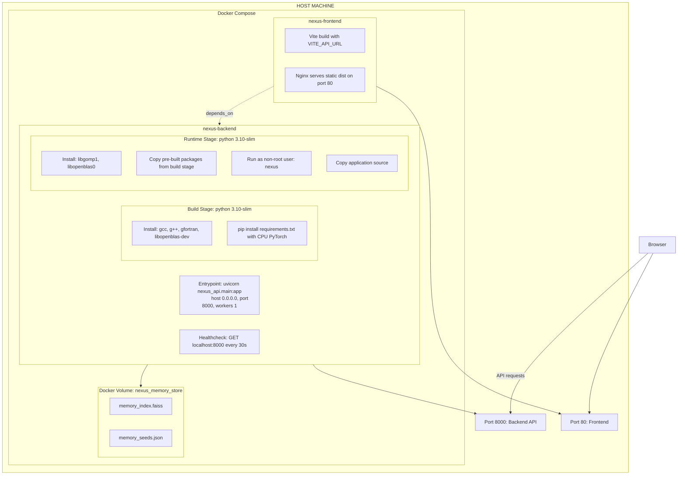

**Why a single uvicorn worker?** The MemoryStore is an in-memory data structure. Each uvicorn worker runs in a separate process with its own memory space. Multiple workers would each have an independent, empty MemoryStore — interactions stored by one worker would be invisible to others. Using a single worker ensures all requests share the same MemoryStore instance. Horizontal scaling is achieved through Docker replicas with shared persistent storage instead.

---

## Configuration Reference

### Model Configuration

| Parameter | Value | Description |
|---|---|---|
| vocab_size | 50,257 | GPT-2 BPE tokenizer vocabulary |
| context_length | 256 | Maximum sequence length the model can process |
| emb_dim | 768 | Embedding and hidden dimension |
| n_heads | 12 | Number of attention heads (head_dim = 64) |
| n_layers | 12 | Number of transformer blocks |
| drop_rate | 0.1 | Dropout probability |
| qkv_bias | False | No bias in attention projections |

### LoRA Configuration

| Parameter | Value | Description |
|---|---|---|
| base_model | gpt2 | HuggingFace GPT-2 124M |
| r | 8 | LoRA rank |
| lora_alpha | 16 | Scaling factor (effective scale = 2.0) |
| lora_dropout | 0.05 | Dropout on LoRA layers |
| target_modules | c_attn | Only the combined QKV projection is adapted |
| task_type | CAUSAL_LM | Causal language modeling |
| trainable params | 294,912 | 0.18% of total model |

### Training Configuration

| Parameter | Value |
|---|---|
| batch_size | 8 |
| learning_rate | 3e-4 |
| num_epochs | 10 |
| eval_freq | 100 |
| eval_iter | 10 |

### Generation Configuration

| Parameter | Value | Description |
|---|---|---|
| max_new_tokens | 60 | Maximum tokens to generate |
| temperature | 0.85 | Sampling temperature |
| top_k | 50 | Top-k filtering |
| top_p | 0.9 | Nucleus sampling threshold |
| repetition_penalty | 1.3 | Penalize repeated tokens |
| no_repeat_ngram_size | 3 | Block repeated 3-grams |

### Memory Configuration

| Parameter | Value | Description |
|---|---|---|
| Embedding model | all-MiniLM-L6-v2 | Sentence-transformers encoder |
| Embedding dimension | 384 | Output vector size |
| FAISS index type | IndexFlatL2 | Exact L2 nearest-neighbor |
| Importance boost | 0.05 | Added when seed is retrieved |
| Importance decay | 0.01 | Subtracted from all seeds per interaction |
| Importance cap | 1.0 | Maximum importance |
| Importance floor | 0.0 | Minimum importance |
| Prune threshold | 0.2 | Seeds below this are removed |
| Prune trigger size | 5 | Pruning only activates with 5+ seeds |

---

## Project Structure

```
Production NEX/
|-- model.py                          # Custom GPT model (development)
|-- generate.py                       # Inference utilities (development)
|-- train.py                          # Training loop (development)
|-- dataset.py                        # Dataset classes (development)
|-- tokenizer_utils.py                # Token conversion utilities
|-- chat.py                           # Interactive CLI chat with RAG
|-- api.py                            # Minimal FastAPI (development)
|-- demo_rag.py                       # RAG demonstration script
|-- debug_server.py                   # Debug server
|-- Dockerfile                        # Multi-stage production build
|-- docker-compose.yml                # Backend + Frontend orchestration
|-- requirements.txt                  # Python dependencies
|
|-- nexus/                            # Core package
|   |-- config.py                     # Model, training, generation configs
|   |-- models/
|   |   +-- model.py                  # GPTModel (package version)
|   |-- memory/
|   |   |-- __init__.py
|   |   +-- memory_store.py           # MemoryStore and KnowledgeSeed
|   |-- rag/
|   |   |-- __init__.py
|   |   +-- rag_pipeline.py           # build_prompt and template
|   |-- inference/
|   |   +-- generate.py               # generate, query_model
|   |-- training/
|   |   +-- train.py                  # train_model_simple
|   |-- data/
|   |   +-- dataset.py                # GPTDatasetV1, InstructionDataset
|   +-- utils/
|       +-- tokenizer_utils.py        # text_to_token_ids, token_ids_to_text
|
|-- nexus_api/                        # Production API
|   +-- main.py                       # FastAPI with OpenRouter and local fallback
|
|-- nexus_lora2/                      # LoRA adapter weights
|   |-- adapter_config.json           # PEFT LoRA configuration
|   |-- adapter_model.safetensors     # LoRA weight delta (~1.1 MB)
|   |-- tokenizer.json                # GPT-2 BPE vocabulary
|   +-- tokenizer_config.json         # Tokenizer settings
|
+-- nexus-frontend/
    +-- Nexus.AI-main/                # React + Vite frontend
        |-- src/
        |   |-- App.jsx               # Routes and loader
        |   |-- main.jsx              # Entry: Clerk and BrowserRouter
        |   |-- Hero.jsx              # Landing page
        |   |-- global.css            # Global styles
        |   |-- pages/
        |   |   |-- Chat.jsx          # Main chat interface
        |   |   |-- Features.jsx      # Features page
        |   |   |-- Signin.jsx        # Login page
        |   |   +-- Signup.jsx        # Registration page
        |   +-- components/
        |       |-- FloatingPillNavbar.jsx
        |       |-- Layout.jsx
        |       +-- loader.jsx
        |-- package.json
        |-- vite.config.js
        |-- Dockerfile                # Nginx for production
        +-- nginx.conf
```

---

## Dependencies

### Python

| Category | Packages |
|---|---|
| API | fastapi, uvicorn, pydantic |
| Model and Inference | torch, transformers, peft, tiktoken, sentencepiece |
| RAG | sentence-transformers, faiss-cpu, numpy |

### Frontend

| Category | Packages |
|---|---|
| Core | react 19, react-dom 19, react-router-dom 7 |
| Styling | tailwindcss 4, clsx, tailwind-merge |
| Animation | motion (framer-motion) 12 |
| Auth | clerk/clerk-react 5 |
| Icons | lucide-react |
| Build | vite 7 |
